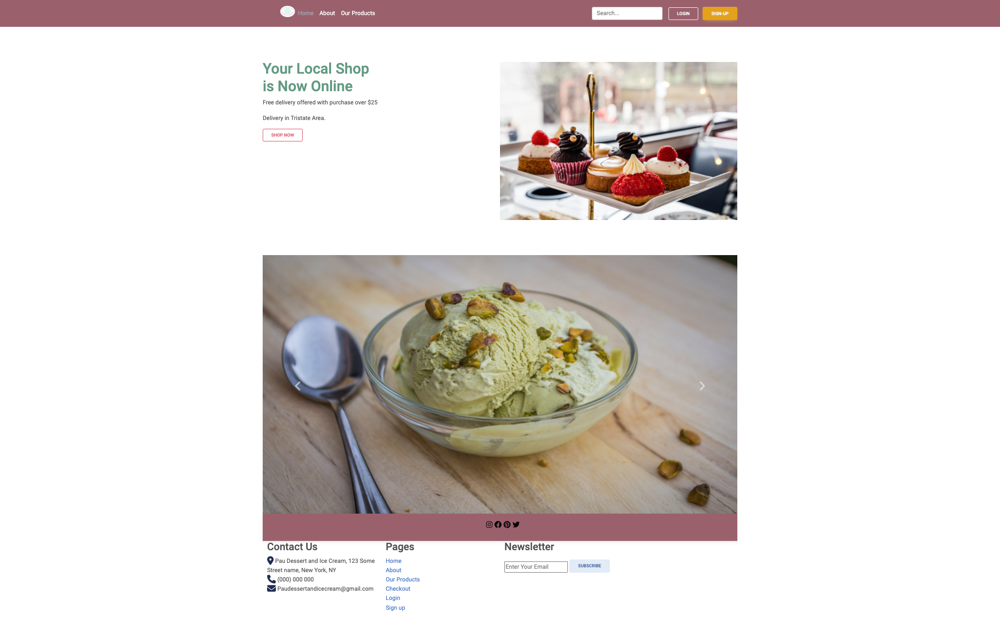

# Capstone1-eCommerce
This is a class capstone project on HTML, CSS, GIT and Bootstrap.
the website contains a minimalistic landing page with buttons to take users to different pages.
Users will get the experience of an e-commerce website with a products page, a page to sign in for check out, a registration page and a checout page with a summary of their orders.
Site is populated with mock data. 

##Sites images

